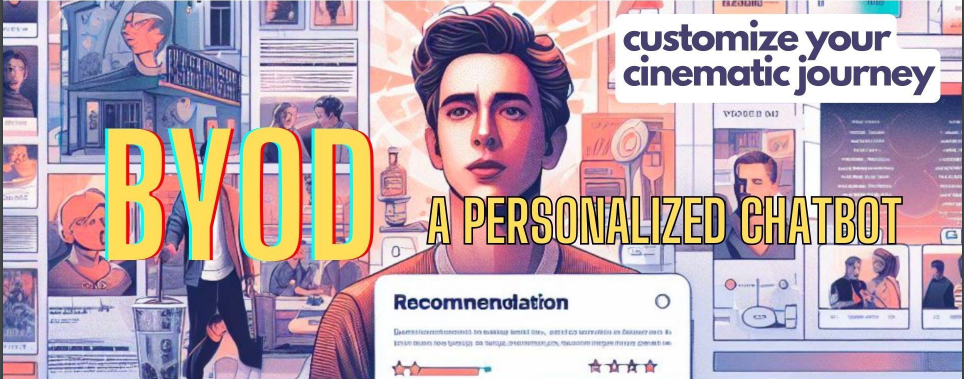
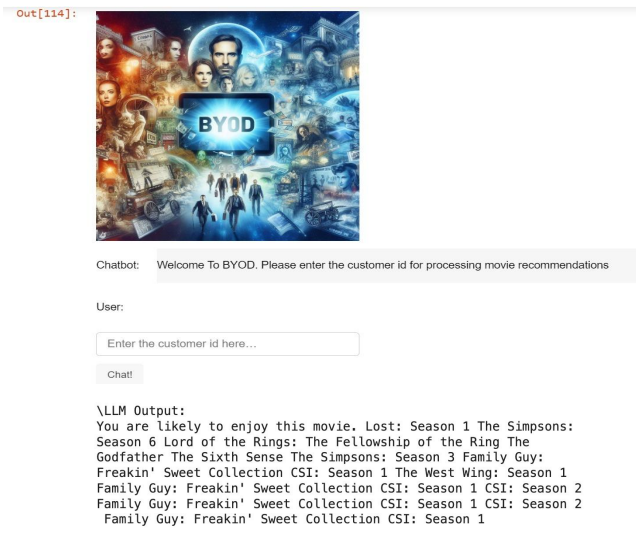

# BYOD-Movie Recommender

**BYOD: Bring Your Own Data** This project aims to provide users with a seamless way to discuss their cinematic tastes, discover new films, and receive personalized movie recommendations. We have designed a chatbot assistant to enhance user interaction through natural language processing, focusing primarily on movie preferences.

## Project Overview
The main aim of the project was to build a custom Chatbot which uses LLM to recommend the movies. But due to resource constraints we were able to recommend movies using various Machine Learning Models and implement a chatbot for the same.

## Key Features
- **Personalized Movie Recommendations**: Engage with the chatbot to receive movie suggestions tailored to your preferences.
- **Natural Language Interaction**: Communicate with the chatbot in natural language to discuss various movie-related topics.

## Dataset
This project utilizes the extensive Netflix Prize dataset, renowned for its comprehensive collection of user movie ratings and diverse selection. Due to the large size of the dataset, it is not directly included in this repository.

Access the dataset here: [Netflix Prize Data on Kaggle](https://www.kaggle.com/datasets/netflix-inc/netflix-prize-data)

## User Interface Preview

The user interface is crafted to be intuitive, ensuring smooth and engaging conversations with the chatbot about movie preferences and recommendations.

## Acknowledgments
- Gratitude to the contributors of the Netflix Prize dataset for providing a rich resource for our recommendation algorithms.
- Appreciation to the AI and machine learning communities for their invaluable resources and support.

